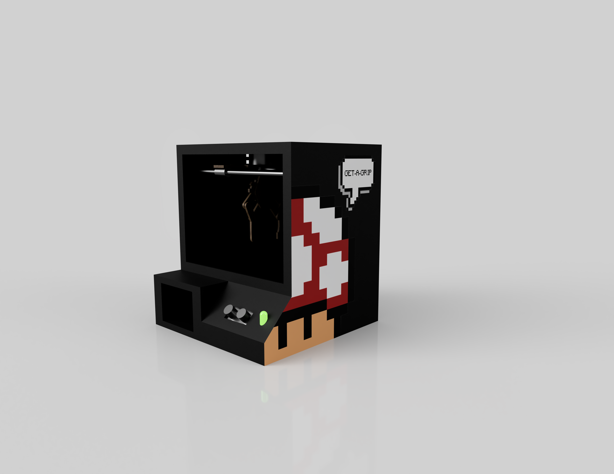
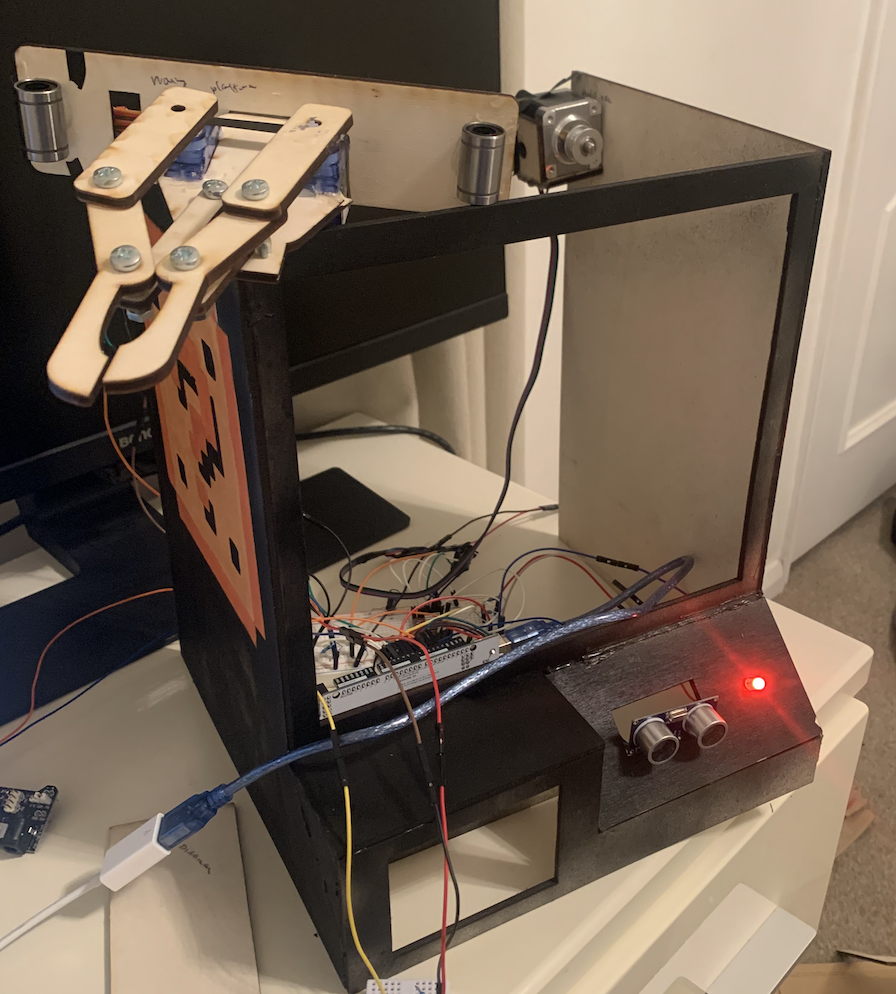
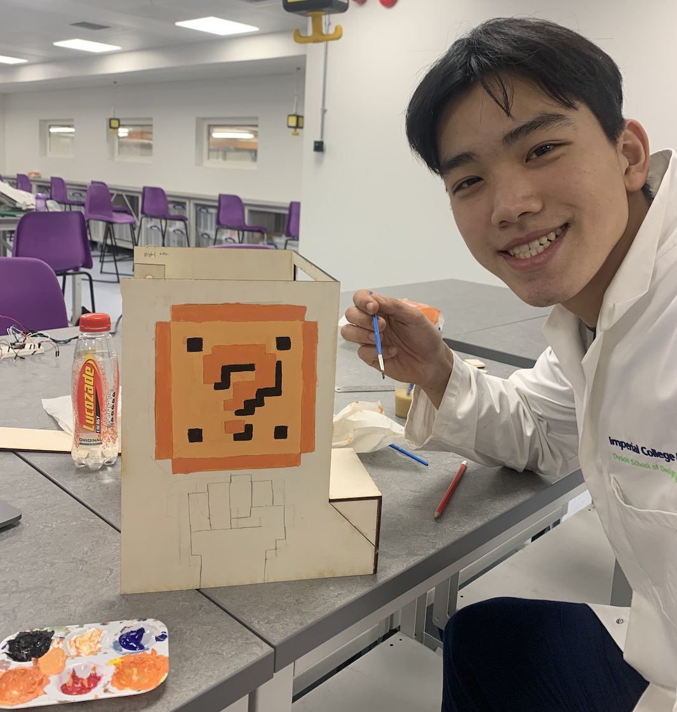
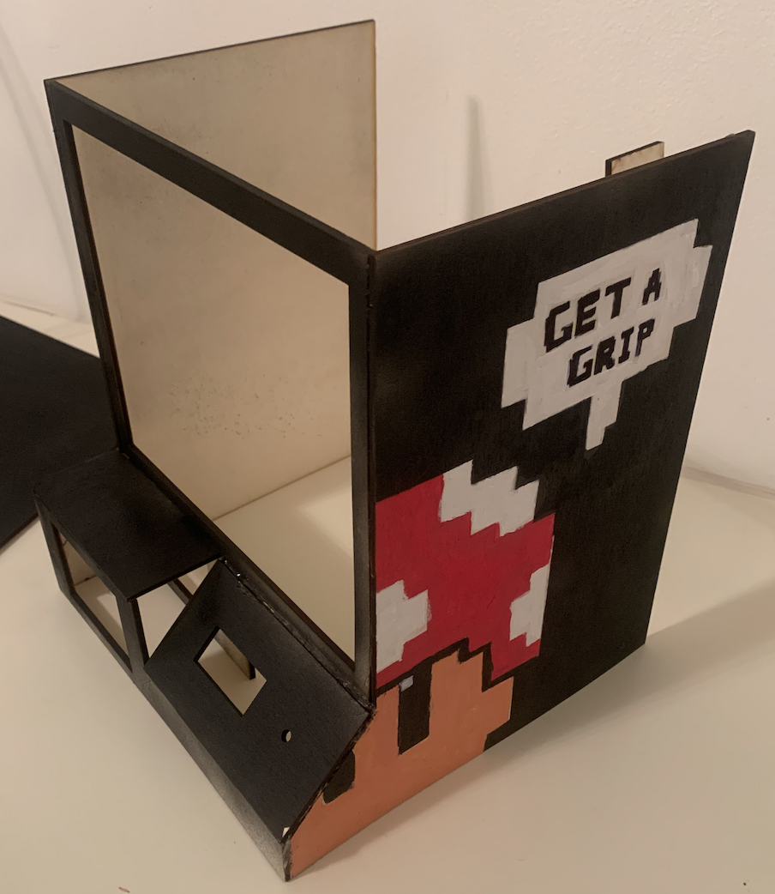
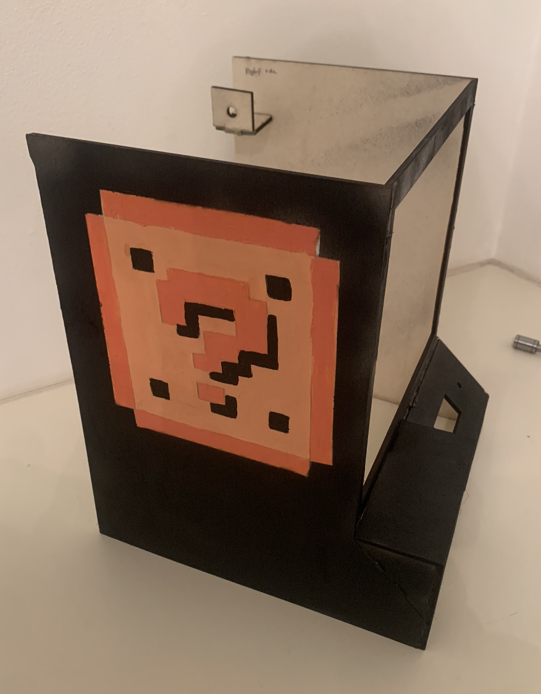
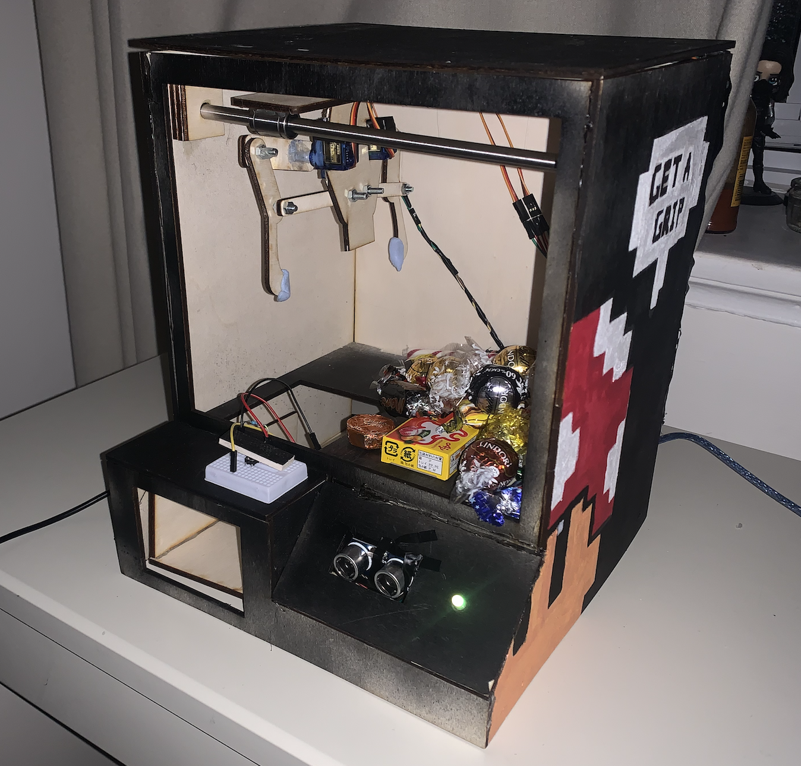
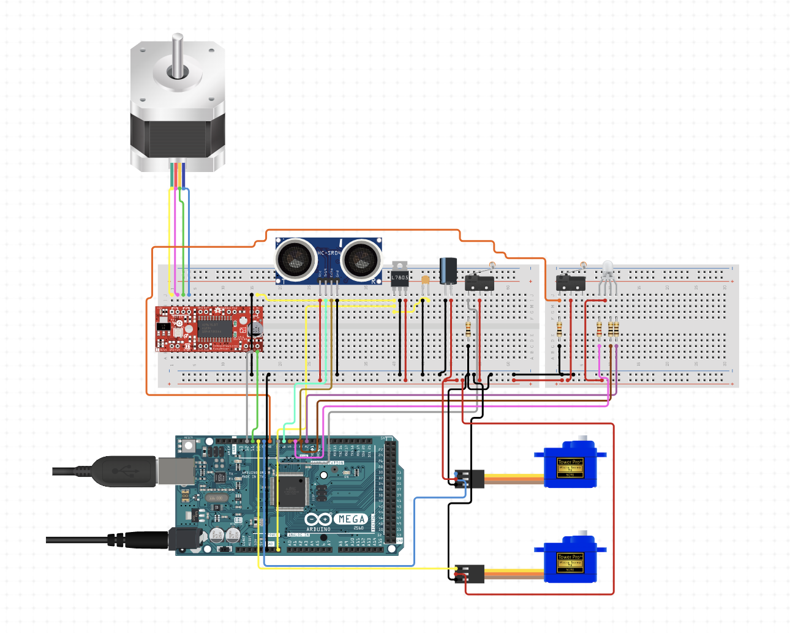
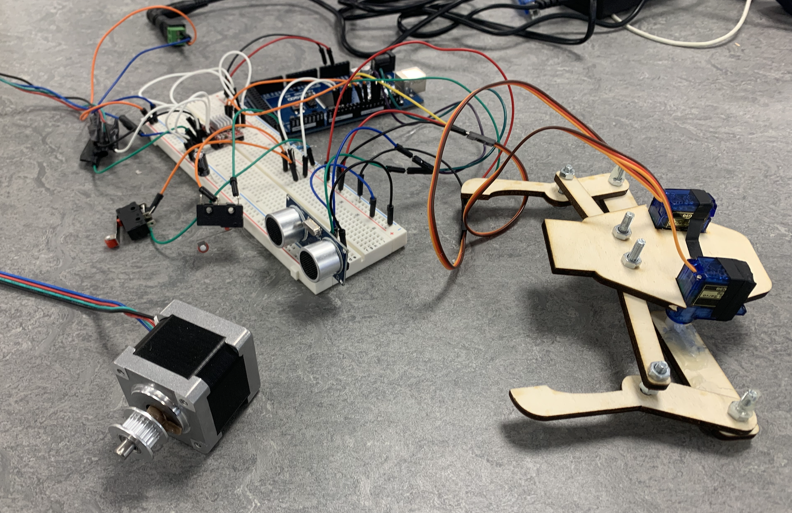

# Homemade Arcade Game — Get-A-Grip

## Overview
**Get-A-Grip** is an interactive arcade claw machine inspired by the Japanese UFO-catcher popularized by SEGA.  
Instead of traditional joystick or button controls, it uses an **ultrasonic sensor** to detect the player’s hand position and control the claw’s horizontal movement. Bright LED lights guide the player, creating an engaging and physically interactive experience.

---

## How It Works
1. **Press the start button** — The green light indicates the game is ready.
2. **3-second countdown** — Bright green flashes, signaling the start.
3. **20 seconds of horizontal control** — Hand distance from the ultrasonic sensor changes claw speed and direction.
4. **Yellow light warning** — Appears halfway and flashes 3 seconds before the end of movement time.
5. **Red light automatic phase** — Claw contracts, grabs the prize, returns to start position, and releases.

---

## Features
- **Physical Interaction**: Hand motion instead of traditional controls.
- **LED Indicators**: Clear visual feedback for game phases.
- **Unique Gameplay**: Encourages repeated attempts with skill-based challenge.
- **Arcade Styling**: Bright colors and fun design.

---

## Technical Specs

**Main Components**
- Arduino MEGA 2560
- 2 × 90g Servo Motors
- NEMA14 Stepper Motor + A4988 Driver
- Ultrasonic Sensor
- RGB LED Light
- 3 × 220Ω Resistors
- 1 × 1kΩ Resistor
- 1 × 100μF Capacitor
- 2 × Limit Switches
- 12V Power Supply

**Mechanical**
- **Gantry Design**: Powered by NEMA14 motor with timing belt and pulley system, controlled by limit switches.
- **Claw Design**: Two opposing servos for smoother and consistent operation.

**Materials**
- Plywood (4mm thick) for walls and claw.
- Stainless steel rods and linear bearings for smooth movement.

---

## Development Process
1. **Project Inspiration**  
   Born from the nostalgic joy of Japanese claw machines, aiming for a more physically interactive twist.
   
2. **Prototyping**  
   - Cardboard mockups for early design.
   - CAD and Illustrator for modeling.
   - Physical builds refined through multiple iterations.

3. **Testing**  
   - Separate coding and testing of each subsystem.
   - Electrical load calculations for safe integration.
   - Final assembly and troubleshooting.

---

## Photos & Videos

### Concept & Early Prototyping

### Build Process

### Electronics

### Testing

[Initial Test Video](assets/initial_test.mov)

---

## Author
**Kennard Mah**  
CID: 01956128
